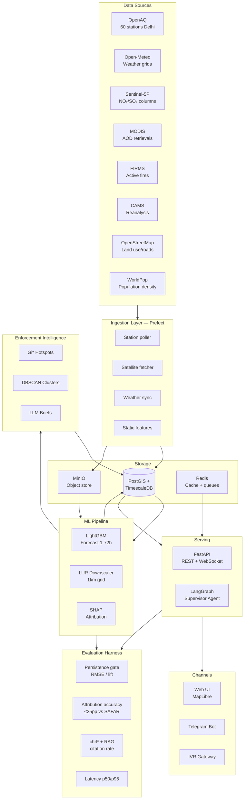

# VayuNetra — System Architecture

## Component Summary

| Layer | Technology | Role |
|-------|-----------|------|
| Ingestion | Prefect 2 | Orchestrated ETL flows with retry + backfill |
| Storage | PostGIS + TimescaleDB | Spatiotemporal hypertables, 1km grid (3 955 cells) |
| Object store | MinIO | Satellite rasters, model artifacts (DVC-tracked) |
| Cache | Redis | Tile cache, rate-limit counters, pub/sub |
| Forecast | LightGBM | 1–72 h ahead, RMSE 47.2 µg/m³ |
| Downscaling | Land-Use Regression | Fuses static features → 1 km resolution |
| Attribution | SHAP | Source-category % contribution |
| Hotspots | Getis-Ord Gi* + DBSCAN | Spatial clustering for enforcement |
| Serving | FastAPI | REST endpoints, Prometheus /metrics |
| Agent | LangGraph | Multi-tool supervisor (forecast, advisory, enforce) |
| UI | MapLibre GL JS | Interactive choropleth + timeline |
| Bot | Telegram + IVR | 12 Indian languages, RAG-backed advisories |
| Eval | Custom harness | Persistence lift, SAFAR benchmark, chrF |
