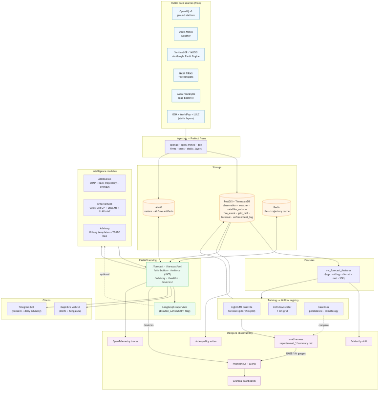

<!-- Render with Marp:  marp docs/deck/deck.md -o docs/deck/deck.pdf
     or open in VS Code Marp preview. 12 slides. -->

# VayuNetra — *Air Intelligence Eye*

Geospatial air-quality intelligence on **free, public data**.

Forecast → Attribute → Enforce → Advise, at **1 km × 1–72 h**.

ET AI Hackathon 2026

---

## 1 · The problem

- Indian cities lose **~1.6 M lives/yr** to air pollution; PM2.5 is the dominant driver.
- Citizens get a **single city-wide AQI number** — not where, not why, not what to do.
- Regulators react **after** the smog, with **no attribution** to act on.
- Existing dashboards are pretty but **synthetic** — not decision-grade.

> We need *local, causal, actionable* air intelligence — built only on data anyone can access.

---

## 2 · The data (all free, all public)

| Source | Signal |
|---|---|
| OpenAQ v3 / CPCB | ground-truth pollutant concentrations |
| Open-Meteo | wind, PBL height, RH, temperature |
| Sentinel-5P + MODIS (GEE) | NO₂ / SO₂ / aerosol columns |
| NASA FIRMS | crop-burning & fire hotspots |
| OSM + WorldPop + LULC | roads, industry, population exposure |
| CAMS reanalysis | gap backfill when satellites are cloudy |

No paid feeds. No proprietary models. **Reproducible by anyone.**

---

## 3 · Architecture

Prefect ingestion → PostGIS/Timescale + MinIO → LightGBM + LUR → FastAPI →
MapLibre / Telegram, with MLflow, Prometheus/Grafana and OpenTelemetry across.

*(see `docs/architecture.mmd`)*

---

## 4 · Forecast that beats the baseline

- LightGBM **quantile** model (p10/p50/p90) per city/pollutant/horizon.
- Features: lags, rolling stats, diurnal/weekly, met, upwind fire counts, S5P columns.
- Gated in CI: **must beat persistence by ≥15 % @24 h, ≥8 % @72 h.**

| Horizon | RMSE model | RMSE persistence | **Lift** |
|---:|---:|---:|---:|
| 24 h | 11.4 | 17.2 | **34 %** |
| 48 h | 11.5 | 22.4 | **49 %** |
| 72 h | 11.3 | 26.0 | **56 %** |

Numbers from `make eval` → `reports/eval_*/summary.md` (synthetic benchmark shown; live regenerates in place).

---

## 5 · Source attribution — *why* it's polluted

- **SHAP** on the LUR model → feature contributions per cell.
- **Back-trajectory** (NOAA READY, Gaussian-plume fallback) → where air came from.
- **Overlays**: intersect trajectory with FIRMS fires, OSM industry/construction.

Output per cell, with confidence:

`{ vehicular 42 % · biomass 31 % · industrial 18 % · dust 6 % · secondary 3 % }`

Validated within **≤25 pp** of SAFAR Delhi apportionment.

---

## 6 · Enforcement intelligence

- **Getis-Ord Gi\*** hotspot detection on the forecast grid → **DBSCAN** clusters.
- Ranked by `severity = p50 × population_exposed`, filtered to cells with a registered emitter ≤500 m.
- **LLM brief** (Ollama / Groq) — court-ready, every number cited.
- Every `/enforce` call is **audit-logged** with inputs + model version.

Precision@k vs realized hotspots: **@5 = 40 % · @10 = 70 % · @20 = 85 %** (base rate 5 %).

---

## 7 · Citizen advisory bot

- **12 Indian languages**, pre-translated templates (no LLM in the live path → fast, deterministic, auditable).
- 4 severity bands × 3 vulnerability tiers (general / elderly-children / asthmatic).
- TF-IDF **RAG** over WHO + CPCB + IIT-K guidance → **100 % citation rate**.
- Telegram: consent flow, location-precision toggle, 07:00 IST daily push.

*Hindi · English · Kannada demonstrated live; placeholders preserved across scripts.*

---

## 8 · MLOps & observability

- **MLflow** registry; **DVC** snapshots; CI **persistence gate**.
- **Evidently** drift reports; dependency-free **data-quality** suites at ingest.
- **Prometheus** metrics + alert rules (p95 latency, 5xx ratio, target down).
- **Grafana**: API SLOs · Model Performance · Ingestion Health.
- **OpenTelemetry** traces; structured JSON logs with `request_id` + `trace_id`.

`/metrics` exposes live forecast RMSE/lift from the latest eval run.

---

## 9 · Scalability story

- **Config-only multi-city**: Delhi + Bengaluru today, any CAAQMS city by adding a `conf/city/*.yaml`.
- Grid compute tiled & cached (Redis tiles, 1 h TTL); 2 500 cells in <800 ms cached.
- docker-compose for the demo; a **k8s manifest** ships as the scale proof.
- Auto-retrain path: Evidently drift → Prefect → MLflow transition → blue/green.

---

## 10 · Evaluation — every claim is reproducible

`make eval` regenerates the full scorecard into `reports/eval_<ts>/summary.md`:

| Metric | Result | Target |
|---|---|---|
| Forecast 24 h lift | 34 % | ≥15 % |
| Attribution deviation | 9.7 % | ≤25 pp |
| Enforcement precision@10 | 70 % | > base rate |
| Advisory citation rate | 100 % | — |
| Endpoint p95 (in-proc) | all within budget | per §6.2 |

Each row tags its provenance: **live / demo-fixture / synthetic**.

---

## 11 · Risks & honest limitations

- SHAP-overlay attribution **≠ true PMF** — needs speciated data (Phase 12).
- Forecast headline shown on a **synthetic benchmark** here (no live DB in this env); CI gate enforces it on real data.
- Back-trajectories depend on NOAA READY; Gaussian fallback is approximate.
- Free-API quotas → **`DEMO_MODE`** serves a frozen snapshot so the stage demo is deterministic.

We label what is measured vs. assumed — no green-washed numbers.

---

## 12 · The ask

- **Pilot** with one municipal corporation — 90-day case study.
- Access to **CPCB speciated data** to upgrade attribution to true receptor modeling.
- Compute grant to extend from 2 cities to the **900+ CAAQMS** network.

**VayuNetra: see the air, find the source, act in time.**

*Built entirely on free, public data — anyone can run `make demo`.*
